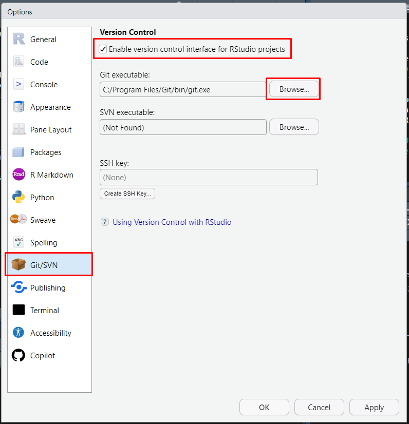
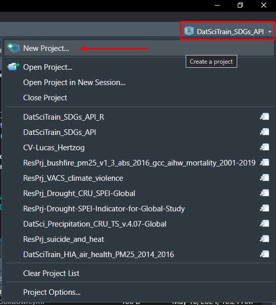
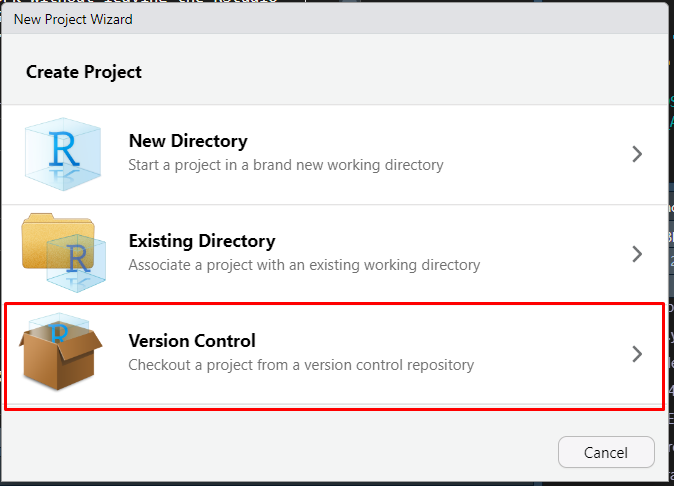
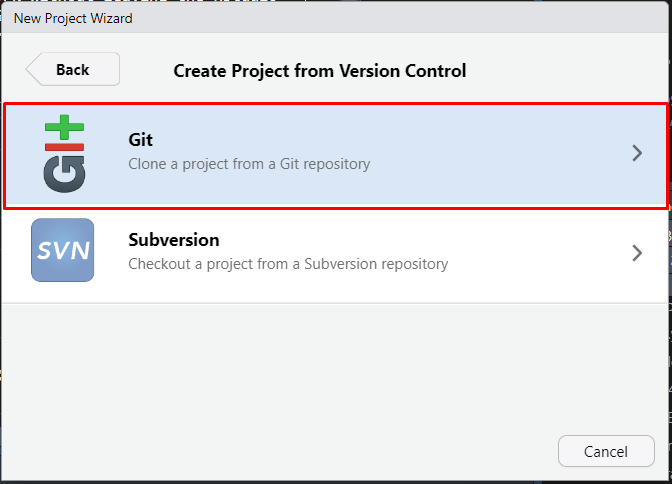

# GitHub

GitHub is a developer platform that allows developers to create, store, manage and share their code.

-   Why GitHub?
    -   Challenges associated with Data Management: sharing data and code.
    -   Simultaneous users working on the same project.
    -   Sharing work in various programming languages.

## Git and RStudio interaction

We can connect Git and RStudio and share our work without leaving the RStudio environment. After installing R, RStudio, and Git and setting up an account on GitHub, it's time to enable version control for RStudio Projects.

### Enable version control

-   For MacOS, it is typically `/usr/local/bin/git`

### Start a new project

